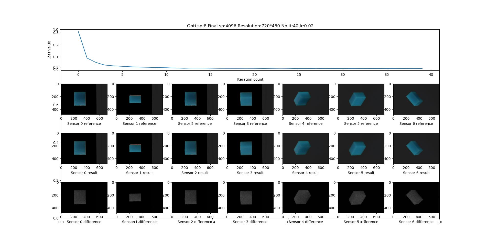

# Chef d'oeuvre 2023-2024

Ce projet se place dans le cadre de l'UE Chef d'oeuvre du Master IAFA de l'Université Paul Sabatier Toulouse III.

> L’objectif est de mettre en application une compilation des connaissances acquises lors du cursus de master en alliant des compétences diverses mêlant à la fois de l’analyse/gestion de données et l’intelligence artificielle.

Dans ce contexte et encadrés par Morgane Gerardin (IRIT équipe STORM), nous avons travaillé sur le sujet suivant.

## Estimation de paramètres de BSSRDF par rendu inverse

### Contexte

Les matériaux translucides (marbre, cire, savon...) se caractérisent par leur propriété de diffusion de la lumière : la lumière est non seulement diffusée à l’interface air/matériau par la rugosité de surface (diffusion surfacique), mais également dans le volume du matériau (diffusion sous-surfacique).
En informatique graphique, il est commun de reproduire l’apparence de matériaux translucides par l’évaluation de la Bidirectionnal Subsurface Scattering Distribution Function (BSSRDF). Les modèles de BSSRDF, généralement analytiques, empiriques, ou issus d’approximation de la théorie du transfert radiatif, sont fonction de paramètres physiques intrinsèques aux matériaux étudiés (coefficient d’extinction, albédo, indice optique). Ces paramètres étant méconnus, il est difficile de reproduire l’apparence d’un matériau translucide donné de manière correcte et plausible visuellement. Il est donc nécessaire de déterminer les valeurs de ces paramètres en amont.
Il est possible de faire cela par rendu différentiable: les paramètres intrinsèques sont déterminés à partir de photographies d’un matériau, par minimisation de l’écart entre ces photographies et des simulations utilisant un modèle de BSSRDF. Cette approche est mise en œuvre par [1], en utilisant un modèle de BSSRDF dit «modèle du dipôle». Il existe d’autre modèles, plus complexes et plus précis, pouvant être utilisés [4,5,6].
L’objectif de ce projet est de déterminer les paramètres intrinsèques de matériaux translucides, par minimisation de l’écart entre données mesurées et simulation de l’apparence en utilisant divers modèles de BSSRDF. Plusieurs données de BSSRDF mesurées sont disponibles pour l’étude [3].

### Objectifs

* Reproduction de l’état de l’art: optimisation des paramètres en utilisant le dipôle comme modèle de BSSRDF [1,2], en utilisant les données mesurées en [3].
* Implémentation d’un autre modèle de BSSRDF parmi les choix proposés [4,5,6].
* Optimisation des paramètres en utilisant le nouveau modèle implémenté comme modèle de BSSRDF.
* Comparaison des résultats obtenus.

### Outils utilisés

Le moteur de rendu différentiable Mitsuba3 est utilisé pour ce projet. Le moteur de rendu a été modifié afin d'ajouter une source de lumière ainsi qu'un modèle de BSSRDF et un intégrateur.

#### Compilation

Après avoir installé les dépendances de Mitsuba3, exécuter ces commandes pour compiler :

```
mkdir ext/mitsuba3/build
cd build
export CC=clang export CXX=clang++
cmake .. -GNinja
ninja
```

Plus de détails concernant les dépendances et la compilation de Mitsuba3 sont disponibles [ici](https://mitsuba.readthedocs.io/en/latest/src/developer_guide/compiling.html).

#### Utilisation des scripts

Avant d'exécuter un script il faut lancer la commande suivante pour pouvoir utiliser Mitsuba3.

```
source ext/mitsuba3/build/setpath.sh
```

##### optiMitsubaExample

Ce script permet de se familiariser avec Mitsuba3 et le rendu différentiable. Il correspond à l'exemple donné dans la doc de Mitsuba3 accessible ici.

##### renderRefImages

Ce script sert à rendre des images synthétiques servant de références pour une optimisation. Un exemple d'utilisation serait

```
python3 renderRefImages.py scenes/refScene.xml ref/synt sensors/sensor.xml
```

##### optiSoap

Ce script optimise le coefficient d'extinction sur un objet en prenant des références synthétiques. Un exemple d'utilisation serait

```
python3 optiSoap.py optimizationScene.xml ref/synt sensors/sensors.xml
```

##### optiMeasured

Ce script optimise le coefficient d'extinction sur un objet en prenant des références mesurées. Les références utilisées ont été mesurées par Morgane Gerardin et sont trop volumineuses pour figurer sur le git. Un exemple d'utilisation serait

```
python3 optiMeasured.py optimizationMeasured.xml ref/synt sensors/sensors.xml
```

#### Utils

Il y a plusieurs scripts dans le dossier utils.

* **arraycapt_to_xml.py** permet de générer des fichiers xml contenant les capteurs afin de les sortir du code

* **displayScene.py** permet d'afficher à l'écran le contenu d'une scène depuis un capteur

* **getCameraTarget.py** permet d'obtenir la position de la cible et le up vector d'une caméra à partir de sa position et de sa direction

* **test_laser.py** permet de tester le laser implémenté dans Mitsuba3 pour les besoins du projet

### Exemple de résultat avec optiSoap.py

 

### Références et liens

1. Reconstructing Translucent Objects using Differentiable Rendering ([lien](https://www.cs.cornell.edu/~xideng/pub/deng22dsss.pdf))
2. Codes ([lien](https://github.com/joyDeng/InverseTranslucent/blob/main/README.md))
3. Données mesurées kiwi et savon ([lien](https://drive.google.com/drive/folders/1JrTtno7c-FnYuNJ044FKbjlZYujJiczN))
4. Light Diffusion in Multi-Layered Transparent Materials ([lien](http://graphics.ucsd.edu/~henrik/papers/layered/layered.pdf))
5. A Quantized-Diffusion Model for Rendering Translucent Materials ([lien](https://dl.acm.org/doi/pdf/10.1145/2010324.1964951))
6. Directional Dipole Model for Subsurface Scattering ([lien](https://dl.acm.org/doi/pdf/10.1145/2682629))
7. Mitsuba3 ([lien](https://mitsuba.readthedocs.io/en/latest/))